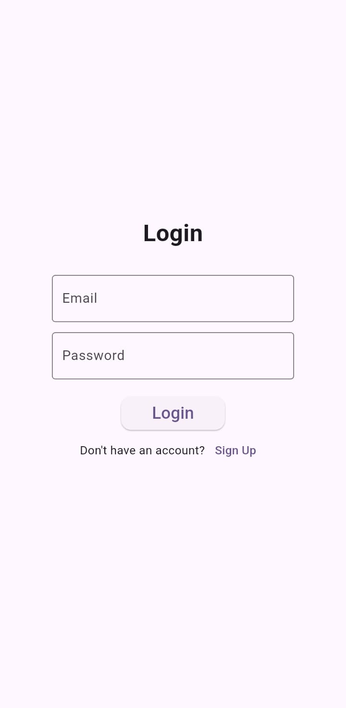
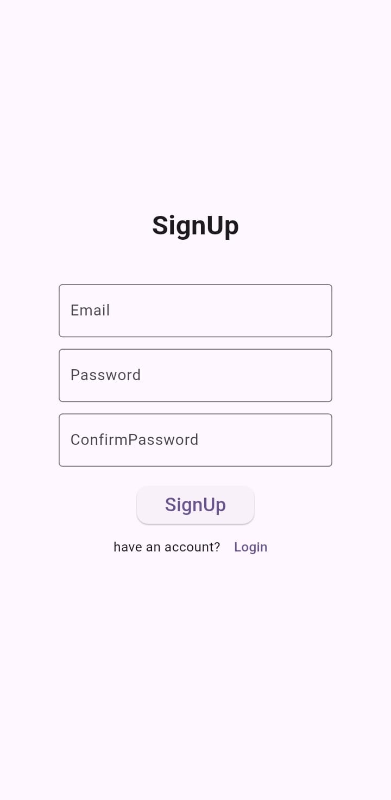
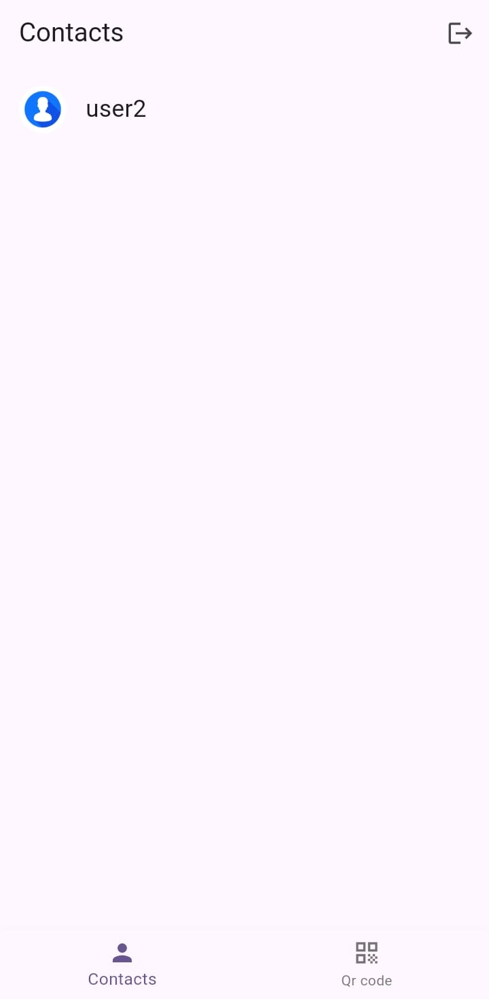
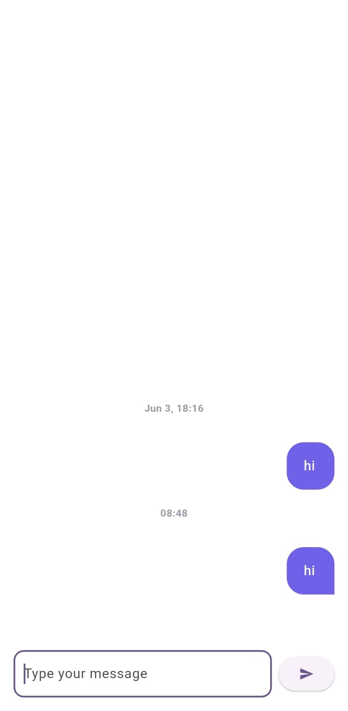
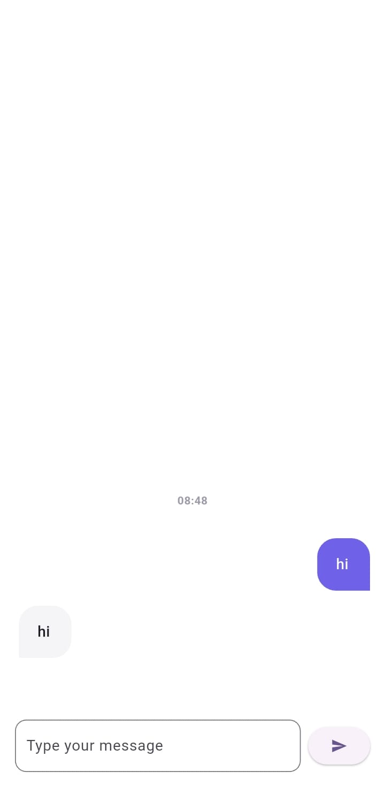
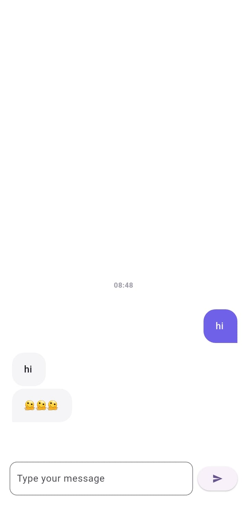

# 💬 ChatApp

A real-time chat application built using **Flutter** for the frontend and **Spring Boot** for the backend, integrating **Firebase Authentication** for user login and **Hive** for local message storage. The app enables users to exchange messages instantly and securely, with each user having a dedicated mailbox to receive messages from multiple users.

## 🔥 Features

- 🔐 Firebase Authentication (Login/Sign-up)
- 📥 One-to-one real-time messaging
- 📬 Mailbox-like architecture: each user receives messages from multiple users in a single thread
- 💾 Local message storage using Hive (NoSQL)
- 🌐 Spring Boot as the signaling backend using STOMP over WebSocket
- 📱 Clean and intuitive UI using Flutter
- ✅ Form validation and error handling

## 🛠️ Tech Stack

### Frontend
- **Flutter**: Cross-platform UI framework
- **Hive**: Lightweight key-value database for local storage

### Backend
- **Spring Boot**: REST APIs & WebSocket signaling
- **STOMP over WebSocket**: For real-time messaging

### Authentication
- **Firebase Auth**: Handles user registration and login securely

---

## 🚀 Getting Started

### Prerequisites

#### Flutter
- [Install Flutter](https://flutter.dev/docs/get-started/install)
- Run `flutter doctor` to verify setup

#### Spring Boot
- Java 17+
- Maven

---

## 📂 Folder Structure

```bash
chatapp/
├── android/
├── ios/
├── lib/
│   ├── screens/
│   ├── widgets/
│   └── models/
├── springboot-backend/
│   ├── src/main/java/
│   ├── src/main/resources/
│   └── pom.xml
```
## Command to run
### Flutter

cd chatapp

flutter pub get

flutter run

### springboot

cd springboot-backend

./mvnw spring-boot:run

## 📸 Screenshots

<h3>🔐 Login Screen</h3>


<h3>📝 Sign Up Screen</h3>


<h3>👥 Contacts</h3>


<h3>💬 Chats (User 1 & User 2)</h3>
<p float="left">
  
  
</p>


